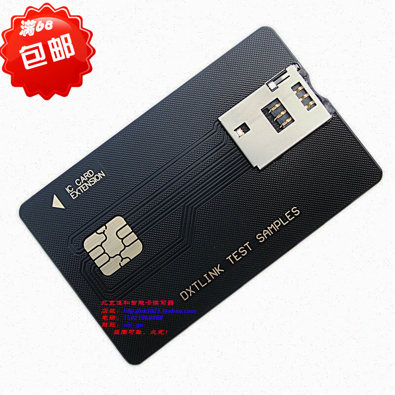
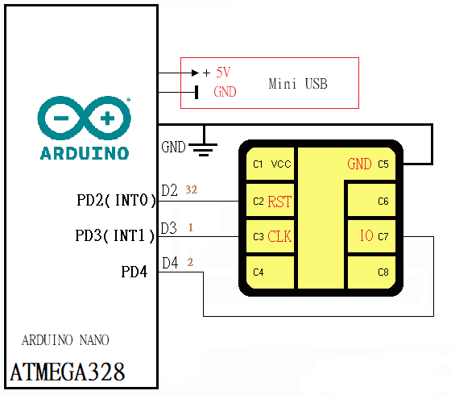
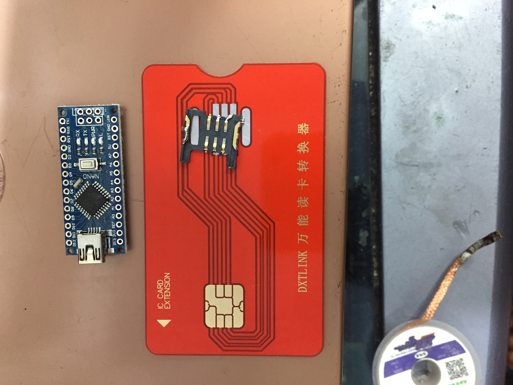
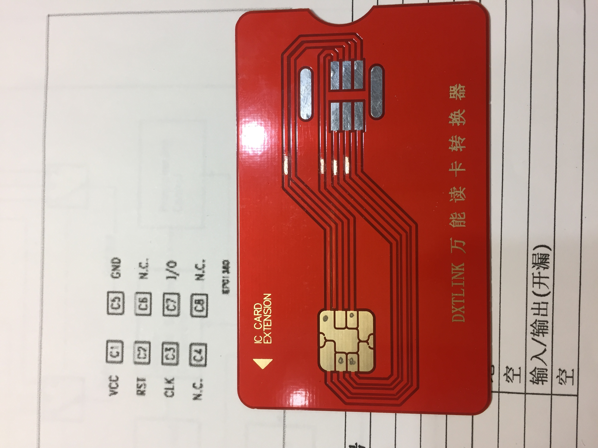
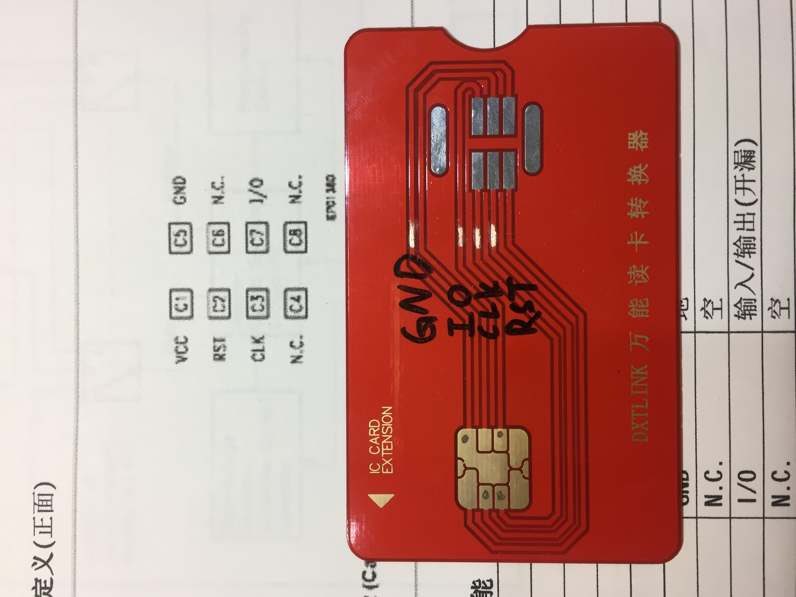

# SLE4442
- 我使用arduino nano 模擬SLE4442 卡
- 冷氣不用錢才會爽

# 材料
## 1.
Arduino Nano
## 2.
SIM卡转换卡托
小卡转大卡
写卡转换卡套

https://item.taobao.com/item.htm?spm=a230r.1.14.69.7ab24ceemfsEXN&id=13081331687&ns=1&abbucket=13#detail

https://item.taobao.com/item.htm?spm=a230r.1.14.20.2ae76ee7Xnm2Nl&id=568373119806&ns=1&abbucket=13#detail

https://item.taobao.com/item.htm?spm=a230r.1.14.110.7ced2685eKFe0O&id=13081331687&ns=1&abbucket=13#detail

# 程式
## 程式我是參考[sonovice](https://github.com/sonovice/sle4442)
- 把sle4442.ino 和 memory.h 放一起
- 上傳到arduino
# 接線圖

# 製作步驟
## 1
移除SIM卡座

## 2
刮開所有線
### 刮出 
- GND
- IO
- CLK
- RST

